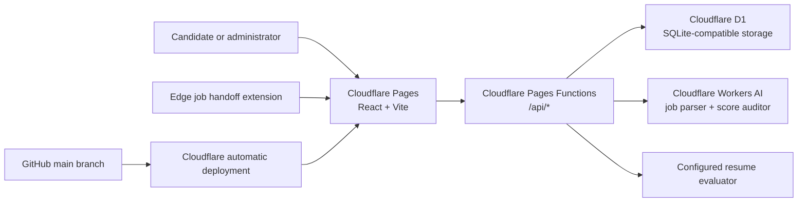
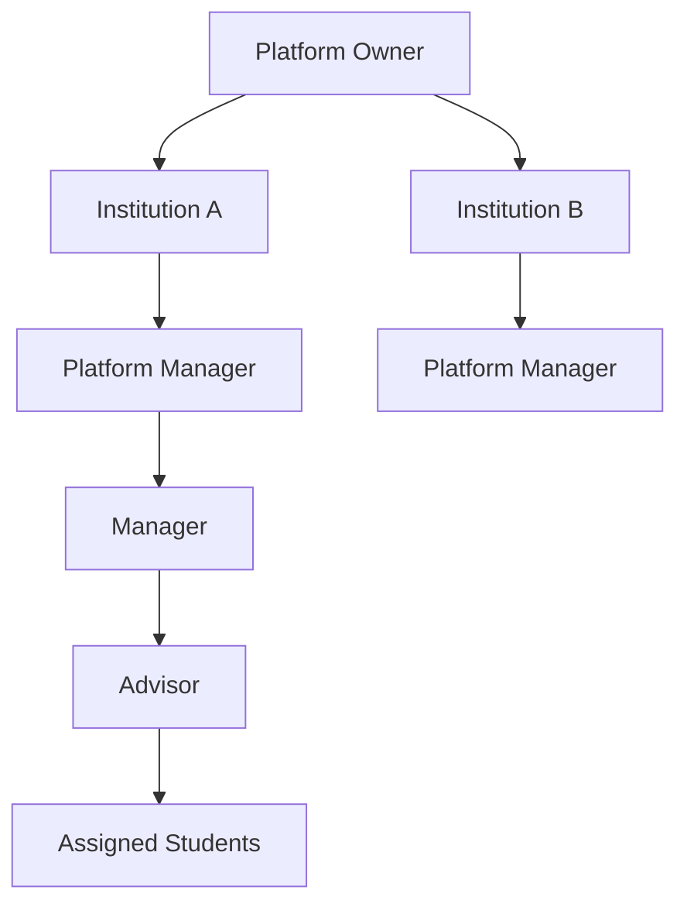

# SagittaIQ Architecture

## Product Shape

SagittaIQ is an early workforce-intelligence platform with two connected experiences:

1. Candidate experience: resume readiness, opportunity tracking, reports, and follow-up.
2. Administrative experience: workforce analytics, waitlist discovery, follow-up
   outcomes, institutional reporting, and operational exports.

## Current Runtime Architecture

## Frontend

- Framework: React + TypeScript + Vite
- Main routing: pathname checks and in-app screen state in `src/App.tsx`
- Public routes:
  - `/about`
  - `/how-it-works`
  - `/data-and-privacy`
  - `/product-family`
- Workflow routes:
  - `/` candidate application
  - `/waitlist` discovery intake
  - `/follow-up` outcome follow-up
  - `/admin` administrative dashboard
- Candidate application screens:
  - dashboard
  - upload/analyze
  - readiness report
  - opportunities

The current app does not use a full routing library or server-rendered framework.

## Backend Functions

Cloudflare Pages Functions under `functions/api` provide:

| Endpoint | Purpose |
| --- | --- |
| `/api/access` | Validates beta access and current email/PIN identity model |
| `/api/analyze` | Calls AI provider and returns structured analysis |
| `/api/applications` | Reads, creates, updates, and deletes opportunities |
| `/api/events` | Records product session and campaign events |
| `/api/follow-up` | Stores workforce outcome follow-ups |
| `/api/health` | Reports configuration health |
| `/api/me` | Returns current user and candidate identifiers |
| `/api/resume-records` | Reads, creates, and deletes resume records |
| `/api/waitlist` | Stores waitlist/discovery intake |
| `/api/admin/summary` | Returns consolidated admin analytics |

Supporting modules:

- `identity.js`: resolves and creates current users
- `ids.js`: generates human-readable platform IDs
- `scoring.js`: deterministic readiness scoring and qualification normalization

## Scoring Architecture

Cloudflare Workers AI orchestrates a job-structure pass and an independent
post-score audit. The configured resume evaluator produces structured evidence
and narrative guidance. The readiness score is calculated by deterministic
application logic using a versioned rubric. Extracted job qualifications are
stored on the opportunity and reused to reduce score drift.

Current version: `sagittaiq-readiness-v1.3`

This separation is intentional:

- AI handles ambiguity, extraction, and prose.
- Code handles the auditable numeric score.
- The score auditor can flag questionable results but cannot change the score.

## Current Identity And Access

Current state:

- Candidate beta access uses a shared beta code.
- Optional email and four-digit user PIN link activity across devices.
- Candidate and other visible platform IDs are generated from counters.
- Admin access uses shared admin or owner access codes.

This is suitable only for a controlled beta. It is not a complete institutional
identity or authorization system.

Target state:

- Verified managed authentication owns email verification.
- Stable `user_id` is the canonical relationship key.
- `candidate_id` remains a visible support/reference identifier.
- Staff access uses named memberships, tenant-scoped roles, and invitations.
- Sensitive actions require elevated authentication and append-only audit events.

## Target Institutional Architecture

Every query and permission decision must be scoped to an institution membership.
Dedicated customer deployments should be a premium exception, not the default.

## Known Architecture Risks

- Shared codes do not provide named accountability or real role separation.
- Current migrations are not reliably replayable from zero.
- No automated test suite or CI quality gate exists.
- Raw resume retention and administrative access require stronger governance.
- Product analytics and security audit logging are not yet separated.
- Admin summary queries have scale limits that can undercount larger datasets.
