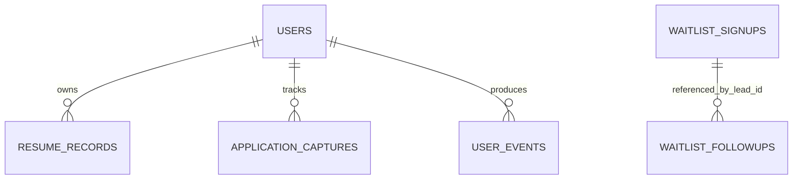

# SagittaIQ Database Reference

Database: Cloudflare D1 `fokalview-resume-analyzer`

The schema is currently built through SQL files in `migrations/`. The tables below
describe the current intended production schema after migrations `0001` through
`0015` have been applied.

## Current Tables

### `users`

Represents the current candidate/user identity.

Important fields:

- `id`: internal user primary key
- `candidate_id`: visible platform candidate identifier
- `client_hash`: current identity lookup value
- `identifier_type`: device-linked or email-linked
- `email_domain`, `email_domain_type`, `country`: aggregated analytics signals
- `security_pin_hash`, `security_pin_set_at`: current beta PIN implementation

### `resume_records`

Stores a structured resume profile, analysis, optional raw resume text, and report identity.

Important relationships:

- `user_id` -> `users.id`
- `opportunity_id` -> application/opportunity record identifier by application logic

Important fields:

- `report_id`
- `target_role`
- `job_context`
- `profile_json`
- `analysis_json`
- `raw_resume_text`
- `raw_resume_retained`

### `application_captures`

Stores candidate opportunities and their readiness history.

Important relationships:

- `user_id` -> `users.id`

Important fields:

- `application_id`
- title, company, location, salary, URL, source, notes, and status
- `job_description`
- `job_qualifications_json`
- `latest_readiness_score`
- `latest_analysis_json`
- `analysis_history_json`
- `analysis_count`
- `last_analyzed_at`

### `waitlist_signups`

Stores discovery leads, candidate/institution intake, academic profile fields, and
lead-scoring data.

Important identifiers:

- `lead_id`
- `contact_id`
- `organization_id`
- `candidate_id`

Important data groups:

- contact/domain/location and source information
- user type and organization type
- discovery interests and buying signals
- branching intake and workforce region
- program, major, degree, class year, student/seeking status
- school, GPA, and certifications
- lead score, priority, and recommended action

### `waitlist_followups`

Stores follow-up research and reported outcomes.

Important fields:

- lead/candidate/contact identifiers
- current and placement statuses
- application, interview, and offer counts
- employer, job title, salary, outcome date, location
- verification status and data source

### `user_events`

Stores product analytics events.

Important fields:

- user/candidate/lead identifiers
- event type and source
- page path, session ID, and duration
- campaign and metadata JSON

This table is product analytics. It should not become the only security audit log.

### `platform_id_counters`

Generates sequential visible IDs for lead, contact, organization, candidate,
application, pilot, and report records.

## Current Relationship Model

Some relationships are currently enforced by application logic rather than formal
foreign keys. This should be tightened during the institutional schema redesign.

## Migration Warning

The current migration history is not safely replayable from a new database:

- `0001` creates `application_captures.salary`; `0003` adds it again.
- `0002` creates user analytics fields; `0004` adds them again.
- D1 does not support `ALTER TABLE ... ADD COLUMN IF NOT EXISTS`.

Do not blindly replay all current files against a fresh or partially migrated
database. Verify columns before applying migrations. Before institutional rollout,
create a clean baseline migration and a migration ledger.

## Planned Institutional Tables

The target tenant and authorization model should add:

- `institutions`
- `institution_settings`
- `memberships`
- `role_assignments`
- `advisor_student_assignments`
- `invitations`
- `staff_users` or a unified authenticated user model
- `security_audit_events`
- `data_access_reasons`
- `retention_policies`

Every institutional record must include or resolve to an `institution_id`.

## Data Governance Rules

- Never place secrets, access codes, or API keys in D1 records.
- Do not treat hashing as consent, anonymization, or a replacement for access control.
- Raw resumes and educational/profile data require an explicit retention policy.
- Define deletion, export, correction, and access-review procedures before broad use.
- Separate product analytics from append-only security audit records.
